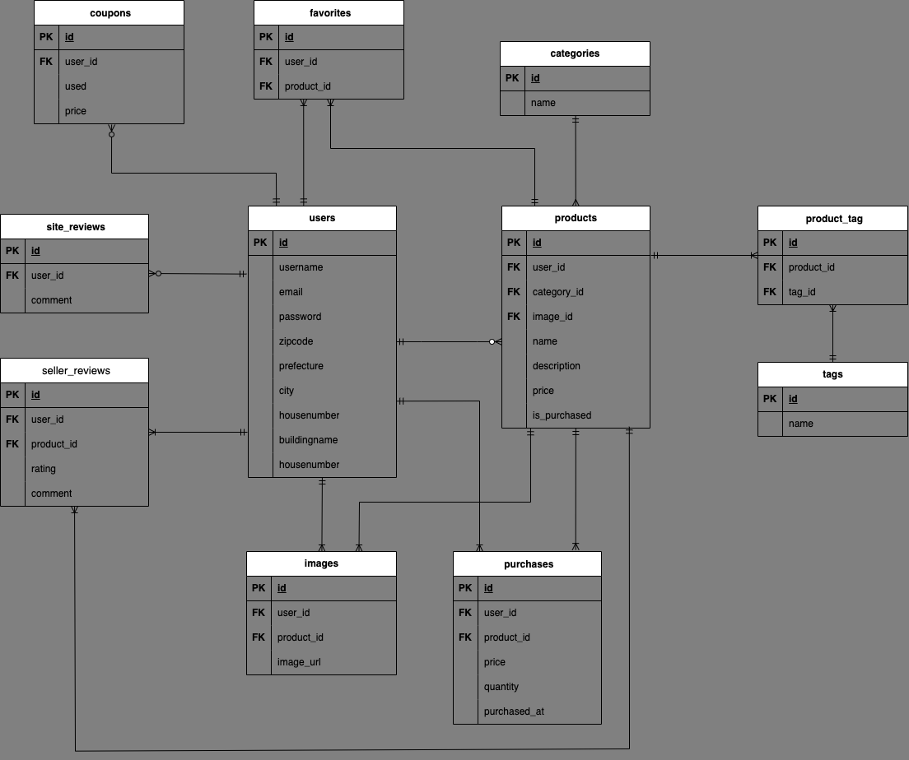

# MovieLikes
## 初めに
プログラミング学習の成果物として今回のポートフォリオを制作いたしました。
アウトプットとしてこちらに投稿します。
## ポートフォリオについて
『MovieLikes』という名前で映画の円盤販売のフリマアプリの開発いたしました。
なぜなら私は映画が好きなのですが、
サブスクでの配信もなくすでに販売されていない映画の
流通ルートを作りたいと思ったからです。
開発に当たって出品者はアピールをしやすいように商品説明機能や在庫管理しやすい出品履歴機能を、
ユーザーレビュー機能により購入者が安心して取引できるようにし、
自分と同じように映画を好きな人が利用したくなるよう意識しました。
## 開発環境
・PHP7.4.33
・Laravel8.0
・Docker
・MySQL
・Github
・Visual Studio Code

## 実装機能
| No|    機能　   　　|  　　　　　　機能について 　　　　　 |
|:-:|:-----------------:|:-----------------------:|
| 1 |新規登録機能|                                   |
| 2 |ログイン機能|                                   |
| 3 |ゲストログイン機能|新規登録不要の予め登録されているユーザー|
| 4 |商品の検索機能|商品一覧から該当の商品を検索できる|
| 5 |ページネーション機能|商品一覧、出品履歴、購入履歴,お気に入りページに|
| 6 |商品出品機能|商品の名前、説明、値段、ジャンル、画像などを登録|
| 7 |商品の削除機能||出品者が商品を削除できる|
| 8 |商品購入機能|商品の購入する|
| 9 |ユーザーレビュー機能|購入者が出品者のレビューをする|
| 9 |サイトレビュー機能|ユーザーがサイトのレビューをする|
| 11|出品履歴機能　|出品履歴を確認できる|
| 12|購入履歴機能　|購入履歴を確認できる|
| 13|お気に入り機能　|商品をお気に入り登録できる|
| 14|クーポン機能　|クーポンが使用できる|
| 18|マイページの編集機能　|マイページを編集できる|

## DB設計
